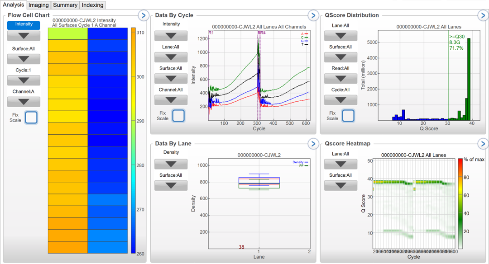
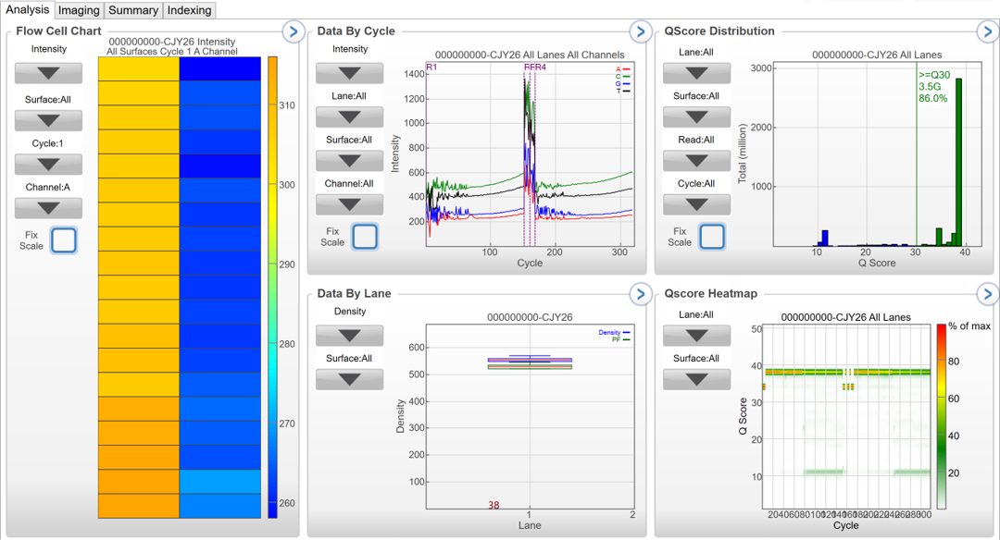

```{r setup}
knitr::opts_chunk$set(echo = TRUE)
library(tidyverse); packageVersion("tidyverse")
library(yaml); packageVersion("yaml")
library(here); packageVersion("here")
```

# Objective & Details {.tabset .tabset-pills}
Determine sources of variability for the CHANGE-Seq assay.

## Approach

1. Samples are prepared with the CHANGE-Seq wet lab procedure.
2. Samples are pooled and sequenced. 
3. Resulting FASTQ files are run through the CHANGE-Seq program. 
4. Each samples produces an "identified_matched.txt" file which is what is used and described in this document. 

**Downstream Bioinformatic Analysis:**

1. Loading CHANGE-Seq pipeline output (namely - "identified_matched.txt" files)
2. Annotating CHANGE-Seq data frame with sample pair/replicate information
3. Summary/ Statistical Analysis  
    1. Generating Summary Table  
    2. Interlaboratory Comparison Plots

## Data Overview
### Sample Information

**Letter ID** | **Target Site**
--------------|-----------------
A             | CCR5_site_3
B             | CCR5_site_8
C             | TRAC_site_1
D             | CXCR4_site_7
E             | CTLA4_site_9
F             | AAVS1_site_14

**Experimental Factors**
N: NIST
S: St. Jude

**Acronym** | **Wet Lab** | **Sequencing Lab** | **Bioinformatics**
------------|-------------|--------------------|--------------------
NNN         | NIST        | NIST               | NIST
NSN         | NIST        | St. Jude           | NIST
NSS         | NIST        | St. Jude           | St. Jude

**Lab-Samples** 
* NNN1
  + 01.06.2020 – 01.13.2020: wet lab production 
  + 01.13.2020: samples sequencing libraries (30 uL each) were stored at -20C
  + samples pooled according to St. Jude's  qPCR quant values
  + 03.11.2020 - 03.14.2020: NIST sequencing __NOTE__ This run time is longer than normal for CHANGE-seq since it was run for the full 600 cycles
  + Sierra performed CHANGE-Seq run 06.30.2020
* NNN2 
  + 01.06.2020 – 01.13.2020: wet lab production 
  + 01.13.2020: samples sequencing libraries (30 uL each) were stored at -20C
  + samples pooled according to Natasha's AATI values
  + same library prepped samples as NN1 and NSN1 NSS1 but sequenced on an expired MiSeq kit to test before running new prepped AEF replicate samples. When these were of adequate quality, we incorporated them into this analysis. 
* NSN1 
  + 01.06.2020 – 01.13.2020: wet lab production 
  + 01.13.2020: samples sequencing libraries (30 uL each) were stored at -20C
  + 01.14.2020: 10 uL of each library was shipped on cold pack to St. Jude.
  + samples pooled according to St. Jude's  qPCR quant values
  + Unclear exact dates of the run. CHANGE-seq output files we were sent are dated 02.05.2020
  + 02.06.2020 NIST received from St. Jude: QIAxcel (does DNA fragment analysis), qPCR, and CHANGE-seq output files
  + Sierra performed CHANGE-Seq run 06.30.2020
* NSS1
  + 01.06.2020 – 01.13.2020: wet lab production 
  + 01.13.2020: samples sequencing libraries (30 uL each) were stored at -20C
  + 01.14.2020: 10 uL of each library was shipped on cold pack to St. Jude.
  + samples pooled according to St. Jude's  qPCR quant values
  + Unclear exact dates of the run. CHANGE-seq output files we were sent are dated 02.05.2020
  + 02.06.2020 NIST received from St. Jude: QIAxcel (does DNA fragment analysis), qPCR, and CHANGE-seq output files

*numbers denote replicate numbers*
*St Jude has not yet re-run our sequencing of the original A-F samples. (NNS)*

Samples run with CHANGE-Seq v1.2.7

### Data Pre-Run Steps

**Reference Genome**

Cicera:
> You can download hg38 sequence from: https://hgdownload.soe.ucsc.edu/goldenPath/hg38/chromosomes/ and concatenate only the main chromosome sequences as hg38_chroms_only.fa

I downloaded all files with this naming scheme: "chrom1.fa.gz" + X & Y and concatenated files via:

```{r, engine = 'bash', eval = FALSE}
cd ~/Desktop/reference_genome
cat *.fa > ~/Desktop/reference_genome/combined_hg38_chroms.fa
```

**Trimmed NIST-sequenced files due to extra cycling with our kit via:**

```{r, engine = 'bash', eval = FALSE}
seqtk trimfq -e 150 \
A_S1_L001_R1_001.fastq.gz > A_S1_L001_R1_001_trimmed.fq
```


#### Sequencing Reports & Information

**NN1**


```{r}
NN1_seq_info <- read.csv(here("data-raw/sequencing_info/SAV_NN_A-F_03.14.2020_summary stats.csv"))

NN1_seq_info %>% DT::datatable()
```

**NN1**


```{r}
NN2_seq_info <- read.csv(here("data-raw/sequencing_info/SAV_NN_A-F.re-sequenced_08.14.2020_summary stats.csv"))

NN2_seq_info %>% DT::datatable()
```

**NN Summary**
```{r}
NN2_seq_summ<- read.csv(here("data-raw/sequencing_info/SAV_Summary_NN_March14_2020.csv"))

NN2_seq_summ %>% DT::datatable()
```


==================================================================================================================================================

# Analysis {.tabset .tabset-pills}
## Coding 
### Loading and Munging data 

Locate files, set up metadata df
```{r message = FALSE}
## CREATE METADATA DF
## Using message = FALSE to avoid printing read_tsv message about column specifications
file_list <- as.list(list.files(path = here("data-raw"), 
                           pattern = "identified_matched.txt",
                           include.dirs = TRUE, full.names = TRUE, 
                           recursive = TRUE))

file_names <- str_remove(file_list, paste0(here("data-raw"),"/"))

changeseq_lst <- set_names(file_list, file_names)

## make that into a data frame
changeseq_metadata_df <- tibble(changeseq_file = unlist(file_names)) %>% 
  separate(changeseq_file, c("lab","changeseq_run"), 
           sep = "/", remove = FALSE) %>% 
  mutate(target_site = str_remove(changeseq_run, "_identified_matched.txt"),
         target_site = str_remove(target_site,  "CRL[:digit:]*_"))

## READ IN FILES - CREATE 1 DF
changeseq_df <-changeseq_lst %>%
  map_dfr(read_tsv, .id = "changeseq_file")

## Annotating with sample metadata
changeseq_anno_df <- changeseq_df %>% 
  left_join(changeseq_metadata_df) %>% 
  mutate(changeseq_run = str_remove(changeseq_run, ".*/"))
```


==================================================================================================================================================

### Calculating Summary Metrics

**Total Read Counts per Sample**
```{r}
total_count_df <- changeseq_anno_df %>% 
    group_by(changeseq_run, lab, target_site) %>% 
    summarise(total_read_count = sum(Nuclease_Read_Count))
```

**Total on-target read count**
```{r}
target_count_df <- changeseq_anno_df %>% 
    filter(Site_Substitution_Number == 0) %>% 
    rename(on_target_count = Nuclease_Read_Count) %>% 
    select(changeseq_run, lab, target_site, on_target_count)
```

**Percent on-target read count (on-target read count/total read count)**
```{r}
on_off_target_df <- left_join(total_count_df, target_count_df) %>% 
    mutate(on_target_rate = on_target_count/total_read_count)
```

**Total off-target read count**
**Percent off-target read count (off-target read count/total read count)**
```{r}
summary_df <- changeseq_anno_df %>% 
    ## replace NAs in Site_Substitution_Number col
    mutate(Site_Substitution_Number = if_else(is.na(Site_Substitution_Number), -1, Site_Substitution_Number), 
           ## assign read count to on-target col of on-target row per sample
            on_target = if_else(Site_Substitution_Number == 0, Nuclease_Read_Count, 0),
           ## assign off-target read counts in non-on-target rows
            off_target = if_else(on_target == 0, Nuclease_Read_Count, 0),
            ## seqs with subs only = seq in Site_Sequence col only
            Sub_Only = if_else(is.na(Site_Sequence_Gaps_Allowed), TRUE, FALSE),
            ## seqs with indels only = seq in Site_Sequence_Gaps_Allowed col only
            Indel_Only = if_else(is.na(Site_Sequence), TRUE, FALSE),
            ## seqs with two possible reps = seq in both cols
            Sub_or_Indel = if_else((Sub_Only == FALSE & Indel_Only == FALSE), TRUE, FALSE))
```
  
**Number of sequences with substitutions only**
**Number sequences with indels only**
**Number of sequences with two possible representations (substitutions or indels)**
```{r}
## create df to plot off-target ratio
off_target_ratio <- summary_df %>%  
    group_by(changeseq_run, lab, target_site) %>% 
    summarise(total_count = sum(Nuclease_Read_Count),
              total_on_target = sum(on_target),
              total_off_target = sum(off_target),
              off_target_ratio = total_off_target/total_count)
## create df to plot alignment of off-target seq resolution details
off_target_seq_align_df <- summary_df%>%    
    group_by(changeseq_run, lab, target_site) %>%
    summarise(total_sub_only_seqs = sum(Sub_Only),
              total_indels_only = sum(Indel_Only),
              total_sub_or_indel = sum(Sub_or_Indel))
```

__NOTE__ CONSIDERING SEQUENCES THAT HAVE SUBSTITUTIONS ONLY...
**On-target to top 25% reads (on-target read count/top 25% off-target read count)**
```{r}
## create df of all off-target rows sorted by decreasing read count value
off_target_df <- summary_df %>%
  filter(!Site_Substitution_Number == 0) 

## take the top 25% of the off-target df - based on read count value
top_quarter_off_target_df <- off_target_df %>%
      filter(Sub_Only == TRUE) %>%
        arrange(-Nuclease_Read_Count) %>%
    ## Use top_frac to get the top 25% - use group_by to capture within run or site analysis
      top_frac(0.25, wt = Nuclease_Read_Count) %>%
  group_by(changeseq_run, lab, target_site) %>% 
  summarise(top_quarter_offtarget_readcount = sum(Nuclease_Read_Count))
```

**On-target to most prevalent off-target read (on-target read count/off-target read with largest read count)**
```{r}
## create df to plot ratio between on-target read count and most prevalent off-target read count per sample
on_top_off_df <- summary_df %>% 
    group_by(changeseq_run, lab, target_site) %>% 
    summarise(on_target_count = max(on_target),
              off_target_max = max(off_target)) %>% 
    mutate(on_off_max_ratio = on_target_count/ off_target_max)
```

**Read count for seqs w/ 1 substitution from target sequence**
**Read count for seqs w/ 2 substitutions from target sequence**
**Read count for seqs w/ 3 substitutions from target sequence**
**Read count for seqs w/ 4 substitutions from target sequence**
**Read count for seqs w/ 5 substitutions from target sequence**
**Read count for seqs w/ 6 substitutions from target sequence**
```{r}
## create df to plot the binned read counts of off-target substitution numbers
substitution_readcount_df <- summary_df %>% 
    filter(Sub_Only == TRUE,
           ## rids rows with NAs that were set to -1 earlier (these are off-targets with indels only)
           Site_Substitution_Number > 0) %>% 
    group_by(changeseq_run, lab, target_site, Site_Substitution_Number) %>% 
    summarise(substitution_read_count = sum(Nuclease_Read_Count))
```

## Table

```{r}
## Making substitution count data frame wide for join
sub_counts_wide_df <- substitution_readcount_df %>% 
  mutate(Site_Substitution_Number = paste("sub",Site_Substitution_Number, "count", 
                                          sep = "_")) %>%
  pivot_wider(names_from = Site_Substitution_Number, 
              values_from = substitution_read_count, values_fill = 0)

## Combining summary metric data frames
summary_table <- left_join(off_target_ratio, off_target_seq_align_df) %>% 
  left_join(top_quarter_off_target_df) %>% 
  left_join(on_top_off_df) %>% 
  left_join(sub_counts_wide_df) %>%
  mutate_if(is.numeric, round, digits = 3)

## write out summary table
## Note - do not need to use paste with here, here converts the vector of character strings to a file path
write_tsv(summary_table, path = here("data", "summary_stats_table.tsv"), 
          na = "NA", append = FALSE, col_names = TRUE, quote_escape = "double")
```


```{r}
## Potentially use the DT or other packages for visually pleasing table presentation
summary_table %>% DT::datatable()
```

**Summary Stats Table Column Headers**

 [1] **"changeseq_run":** lab identifiers, sample letter ID, target site                  
 [2] **"lab":** 3-letter identifiers for wet lab, sequencing lab, and bioinformatics lab; **N**IST, **S**t. Jude                           
 [3] **"target_site":** target site                   
 [4] **"total_count":** total read count for that sample (both on and off-target)                   
 [5] **"total_on_target":** total read count for the on-target sequence for that sample                
 [6] **"total_off_target":** total read count for the off-target sequences for that sample                
 [7] **"off_target_ratio":** total on-target read count/total off-target read count               
 [8] **"total_sub_only_seqs":** total read count for the off-target sequences that are resolved in alignment with nucleotide substitutions only  
 [9] **"total_indels_only":** total read count for the off-target sequences that are resolved in alignment with gaps (indels) only              
 [10] **"total_sub_or_indel":** total read count for the off-target sequences that are resolved in alignment with substitutions or gaps             
 [11] **"top_quarter_offtarget_readcount":** the total read count for the top quarter of off-target reads (sorted by decreasing read count) 
 [12] **"off_target_max":** the read count for the most prevalent off-target sequence (off-target sequence with largest read count)                 
[13] **"on_off_max_ratio":** on-target read count/read count for most prevalent off-target sequence                 
[14] **sub_X_count:** the unique substitution number found across the samples with the total number of occurrences of that read number in the off-target coordinates across each sample

## Plots
### Total Read Counts & On-Target Read Counts per Sample

For each target site, each lab's total read count is plotted. This gives an idea how much data is generated as a whole for each target site. For each target site, each lab's total on-target read count is plotted. 


```{r}
ggplot(total_count_df) + 
    geom_bar(aes(x = target_site, y = total_read_count, fill = lab), 
             position = "dodge", stat = "identity") +
    theme_bw() + 
    theme(axis.text.x = element_text(angle = 90)) + 
    labs(x = "Editing Target Site", y = "Total Read Count", 
         fill = "Lab")
```

```{r}
ggplot(target_count_df) + 
    geom_bar(aes(x = target_site, y = on_target_count, fill = lab), 
             position = "dodge", stat = "identity") +
    theme_bw() + 
    theme(axis.text.x = element_text(angle = 90)) + 
    labs(x = "Editing Target Site", y = "Total On-Target Read Count", 
         fill = "Lab")
```


Sample F for NSS has a drastically lower read count. 
This was found to be a copy/paste error in their manifest file. 
They were pointing to sample E's read fastq files. 

### On-Target Rate

For each target site, each lab's on target rate (total on-target read count / total read count) is plotted. 

``````{r}
ggplot(on_off_target_df) + 
    geom_point(aes(x = target_site, y = on_target_rate, fill = lab), 
               shape = 21, alpha = 0.5) + 
    theme_bw() +
    theme(axis.text.x = element_text(angle = 90)) +
        labs(x = "Editing Target Site", y = "On Target Rate", 
         fill = "Lab")
```

On-target rates for sample A, E, and F are nearly matched and variance for samples B, C, and D is observed. NIST-sequenced samples are slightly higher.

### Off-Target Rate

For each target site, each lab's off-target rate (off-target read count / total read count) is plotted.

``````{r}
ggplot(off_target_ratio) + 
    geom_point(aes(x = target_site, y = off_target_ratio, fill = lab), 
               shape = 21, alpha = 0.5) + 
    theme_bw() +
    theme(axis.text.x = element_text(angle = 90)) +
        labs(x = "Editing Target Site", y = "Off Target Rate", 
         fill = "Lab")
```

The rates of the off-target sequences are generally all higher than that of the on-target rates. Like the on-target rates, samples A, E, and F are similar in value. Samples B, C, and D have variance with the inverse of the above - the off-target rates are higher for the St. Jude-sequenced samples than that of the NIST-sequenced samples. 


### Off-target Sequence Alignment: Sub/Gap

For each target site, the number of off-target sequences that are resolved by substitutions only, indels (gaps) only, or substitutions *or* gaps are plotted for each lab. 

```{r}
off_target_seq_align_df %>% 
    ## First make the table long
    gather(key = "metric", value = "value", -changeseq_run, -lab, -target_site) %>% 
    ggplot() +
    geom_bar(aes(x = metric, 
                 y = value,
                 fill = lab),
             position = "dodge", 
             stat = "identity"
             ) +
    ## Split plot by summary metric
    facet_wrap(~target_site, scales = "free_y") +
    theme_bw() +
    theme(axis.text.x = element_text(angle = -45, hjust = 0)) +
  labs(x = "Mismatch Type", y = "Number of Sequences/Off-Target Locations", fill = "Lab")
```
__NOTE__ The y axes are different for each target site

The off-target sequences are aligned to the target sequence. These are binned in the following manner: in order to align properly to the target sequence, the off-target sequence could be resolve with substitutions (and assigned a substitution number), gaps (insertions or deletions) or by both possibilities. Here, I have binned them accordingly. As before, no differences are observed between the samples sequenced at St. Jude but run through the CHANGE-Seq bioinformatics pipeline by me and St. Jude, however, variance is observed between the samples sequenced at NIST vs. St. Jude. For samples A and B, NIST-sequenced off-target reads are overall in lower numbers as compared to St. Jude.


### Top 25% off-target read counts

For each target site, weighted by read count, the top 25% off-target sequence read counts for each lab are plotted. 

```{r}
ggplot(top_quarter_off_target_df) + 
    geom_bar(aes(x = target_site, y = top_quarter_offtarget_readcount, fill = lab), 
             position = "dodge", stat = "identity") +
    theme_bw() + 
    theme(axis.text.x = element_text(angle = 90)) + 
    labs(x = "Editing Target Site", y = "Total Read Count of \n Top 25% Off-Targets", 
         fill = "Lab")
```

### Ratio of on-target read counts to the off-target sequence with the highest read count

The on-target read count divided by the most prevalent off-target sequence (the off-target sequence with the largest read count) for each sample is plotted for each lab. 

``````{r}
ggplot(on_top_off_df) + 
    geom_point(aes(x = target_site, y = on_off_max_ratio, fill = lab), 
               shape = 21, alpha = 0.5) + 
    theme_bw() +
    theme(axis.text.x = element_text(angle = 90)) +
        labs(x = "Editing Target Site", y = "On-Target Rate to Most \n Prevalent Off-Target", 
         fill = "Lab")
```

As seen with the on-target rate considering total read counts, NIST has higher rates than St. Jude-sequenced samples. 

### Read counts per subsitution number for each sample

For each substitution number (or for indels only or subs/indels which are grouped separately), the number of off-target sequences that are classified as such as such are plotted for each target sample and lab. 


```{r}
indel_df <- off_target_seq_align_df %>% 
  select(-total_sub_only_seqs) %>% 
  pivot_longer(names_to = "diff_cat", values_to = "read_count", 
               cols = c("total_indels_only","total_sub_or_indel"))

diff_cat_read_count_df <- substitution_readcount_df %>% 
  mutate(diff_cat = str_c("Substitution #", Site_Substitution_Number, sep = "")) %>% 
  select(-Site_Substitution_Number) %>% 
  rename(read_count = substitution_read_count) %>% 
  bind_rows(indel_df)

ggplot(diff_cat_read_count_df) +
    geom_bar(aes(x = diff_cat, y = read_count,
                 fill = lab), 
             position = "dodge", stat = "identity") +
  facet_wrap(~target_site) + 
    theme_bw() + 
    theme(axis.text.x = element_text(angle = 90)) + 
    labs(x = "Alignment  Type", y = "Read Count",
         fill = "Lab")
```

### Number of Locations (Sequences) per Off-Target Sequence Alignment Type

For each target site how many off-target locations (genomic coordinates) are there for each classified substitution (1-6) or gap (aka indel) or substitution/indel.

```{r}
off_targ_num_seq_df <- off_target_df %>%
  select(lab, changeseq_run, 'Genomic Coordinate', Nuclease_Read_Count, Site_Sequence, Site_Substitution_Number, 
         Site_Sequence_Gaps_Allowed, target_site, on_target, off_target, Sub_Only, Indel_Only, Sub_or_Indel) %>%
  ## adding cols for specific sub numbers, indel only and sub/indel cols already exist
    mutate(sub1_only = if_else((Site_Substitution_Number == 1 & (is.na(Site_Sequence_Gaps_Allowed))), TRUE, FALSE),
          sub2_only = if_else((Site_Substitution_Number == 2 & (is.na(Site_Sequence_Gaps_Allowed))), TRUE, FALSE),
          sub3_only = if_else((Site_Substitution_Number == 3 & (is.na(Site_Sequence_Gaps_Allowed))), TRUE, FALSE),
          sub4_only = if_else((Site_Substitution_Number == 4 & (is.na(Site_Sequence_Gaps_Allowed))), TRUE, FALSE),
          sub5_only = if_else((Site_Substitution_Number == 5 & (is.na(Site_Sequence_Gaps_Allowed))), TRUE, FALSE),
          sub6_only = if_else((Site_Substitution_Number == 6 & (is.na(Site_Sequence_Gaps_Allowed))), TRUE, FALSE)) %>% 
    group_by(lab, target_site) %>%
    summarise(sub1_only_total = sum(sub1_only), 
              sub2_only_total = sum(sub2_only),
              sub3_only_total = sum(sub3_only),
              sub4_only_total = sum(sub4_only),
              sub5_only_total = sum(sub5_only),
              sub6_only_total = sum(sub6_only),
              indel_only_total = sum(Indel_Only),
              sub_or_indel_only_total = sum(Sub_or_Indel)) %>%
  pivot_longer(., cols = c(sub1_only_total, sub2_only_total, sub3_only_total, sub4_only_total, sub5_only_total, 
                           sub6_only_total, indel_only_total, sub_or_indel_only_total),
              names_to = "classification", values_to = "num_seqs")


ggplot(off_targ_num_seq_df) +
    geom_bar(aes(x = classification, y = num_seqs,
                 fill = lab), 
             position = "dodge", stat = "identity") +
  facet_wrap(~target_site) + 
    theme_bw() + 
    theme(axis.text.x = element_text(angle = 90)) + 
    labs(x = "Alignment  Type", y = "Number of Sequences/ \n Off-Target Locations",
         fill = "Lab")
```


### Venn Bar: Off-Target Locations 

As opposed to the typical venn diagrams, these show relative abundance and give appropriate scaling to visualize values. 

Based on genomic coordinates, it lists which replicates/samples have the same location (genomic coordinate) in its output. In the plot below the locations that are shared between replicates and unique to each for each sample are shown. 

```{r}
off_target_scatter_df <- off_target_df %>% 
  select(Chromosome, Start, End, Nuclease_Read_Count, target_site, lab) %>%
  filter(!lab == "NSS1")

off_target_lab_set <- off_target_df %>%
  select(`Genomic Coordinate`, target_site, lab, Nuclease_Read_Count) %>% 
  filter(!lab == "NSS1") %>%
  group_by(`Genomic Coordinate`, target_site) %>% 
  summarise(lab_set = str_c(sort(unique(lab)), collapse = "-"))

venn_df <- off_target_df %>%
  select(`Genomic Coordinate`, target_site, lab, Nuclease_Read_Count) %>%
  filter(!lab == "NSS1") %>%
  pivot_wider(names_from = "lab", values_from = "Nuclease_Read_Count", values_fill = NA) %>%
  left_join(off_target_lab_set)

ggplot(data = venn_df) + 
  geom_bar(aes(x = target_site, fill = lab_set), 
           # position = "fill"
           position = "fill"
           ) + 
  coord_flip() + 
  theme_bw() + 
  labs(x = "Target Site", 
       y = "Proportion of Coordinates", 
       fill = "Lab Combinations")
```

```{r}
venn_df %>% group_by(target_site) %>% 
  count(lab_set) %>% 
  pivot_wider(names_from = "lab_set", values_from = "n", values_fill = 0)
```


### Read Count Replicate v Replicate Scatter Plots
#### Overlapping Off-Target Coordinates

To mimic the plots of Figure1, i in the CHANGE-Seq manuscript, common genomic coordinates of off-targets for each sample replicates are plotted in log scale. 

```{r}

nnn1_v_nnn2 <- summary_df %>% 
    mutate(Substitution_Only = if_else(is.na(Site_Sequence), FALSE, TRUE),
           on_target = if_else(Site_Substitution_Number == 0, Nuclease_Read_Count, 0)) %>% 
    filter(Substitution_Only == TRUE) %>%
        arrange(-Nuclease_Read_Count) %>%
  pivot_wider(names_from = "lab", values_from = "Nuclease_Read_Count", values_fill = 0) %>% 
   filter(NNN1 != 0, NNN2 != 0) %>%
  ggplot(aes(x = NNN1, y = NNN2)) + 
   geom_point(alpha = 0.25) + 
   ggpubr::stat_cor(aes(label = ..rr.label..), method = "pearson") + 
  scale_x_log10() + 
  scale_y_log10() + 
  facet_wrap(~target_site, ncol = 1) + 
  theme_bw()

###########

nnn1_v_nnn2 <- off_target_scatter_df %>% 
  pivot_wider(names_from = "lab", values_from = "Nuclease_Read_Count", values_fill = 0) %>% 
   filter(NNN1 != 0, NNN2 != 0) %>%
  ggplot(aes(x = NNN1, y = NNN2)) + 
   geom_point(alpha = 0.25) + 
   ggpubr::stat_cor(aes(label = ..rr.label..), method = "pearson") + 
  scale_x_log10() + 
  scale_y_log10() + 
  facet_wrap(~target_site, ncol = 1) + 
  theme_bw()

## NSN vs. NSS: Concordant Off-Target Coordinates
nsn1_v_nss1 <- off_target_scatter_df %>% 
  pivot_wider(names_from = "lab", values_from = "Nuclease_Read_Count", values_fill = 0) %>% 
   filter(NSS1 != 0, nsn1_v_nss1 != 0) %>%
  ggplot(aes(x = NSN1, y = NSS1)) + 
   geom_point(alpha = 0.25) + 
   ggpubr::stat_cor(aes(label = ..rr.label..), method = "pearson") + 
  scale_x_log10() + 
  scale_y_log10() + 
  facet_wrap(~target_site, ncol = 1) + 
  theme_bw()

## NSN vs. NNN: Concordant Off-Target Coordinates
nsn1_v_nnn1 <- off_target_scatter_df %>% 
  pivot_wider(names_from = "lab", values_from = "Nuclease_Read_Count", values_fill = 0) %>% 
   filter(NSN1 != 0, NNN1 != 0) %>%
  ggplot(aes(x = NSN1, y = NNN1)) + 
   geom_point(alpha = 0.25) + 
   ggpubr::stat_cor(aes(label = ..rr.label..), method = "pearson") + 
  scale_x_log10() + 
  scale_y_log10() + 
  facet_wrap(~target_site, ncol = 1) + 
  theme_bw()

## NSS vs. NNN: Concordant Off-Target Coordinates
nss1_v_nnn1 <- off_target_scatter_df %>% 
  pivot_wider(names_from = "lab", values_from = "Nuclease_Read_Count", values_fill = 0) %>% 
   filter(NSS1 != 0, NNN1 != 0) %>%
  ggplot(aes(x = NSS1, y = NNN1)) + 
   geom_point(alpha = 0.25) + 
   ggpubr::stat_cor(aes(label = ..rr.label..), method = "pearson") + 
  scale_x_log10() + 
  scale_y_log10() + 
  facet_wrap(~target_site, ncol = 1) + 
  theme_bw()

## NNN2 V NSN1
nsn1_v_nnn2 <- off_target_scatter_df %>% 
  pivot_wider(names_from = "lab", values_from = "Nuclease_Read_Count", values_fill = 0) %>% 
   filter(NSN1 != 0, NNN2 != 0) %>%
  ggplot(aes(x = NSN1, y = NNN2)) + 
   geom_point(alpha = 0.25) + 
   ggpubr::stat_cor(aes(label = ..rr.label..), method = "pearson") + 
  scale_x_log10() + 
  scale_y_log10() + 
  facet_wrap(~target_site, ncol = 1) + 
  theme_bw()

## NNN2 V NSS1
nss1_v_nnn2 <- off_target_scatter_df %>% 
  pivot_wider(names_from = "lab", values_from = "Nuclease_Read_Count", values_fill = 0) %>% 
   filter(NSS1 != 0, NNN2 != 0) %>%
  ggplot(aes(x = NSS1, y = NNN2)) + 
   geom_point(alpha = 0.25) + 
   ggpubr::stat_cor(aes(label = ..rr.label..), method = "pearson") + 
  scale_x_log10() + 
  scale_y_log10() + 
  facet_wrap(~target_site, ncol = 1) + 
  theme_bw()
```

```{r fig.height= 6}
ggpubr::ggarrange(nsn_v_nss, nsn_v_nnn, nss_v_nnn, ncol = 3)
```

#### Unique Read Count Occurrence Plots
The read count values for the off-target coordinates unique to replicate 1, replicate 2, and the intersection of the replicates was extracted. Unique read count values from all 3 data were then used to tally each occurrence across the unique genomic coordinates for replicate 1, replicate 2. and the intersection of the replicates

**Our traditional way of viewing**

```{r fig.height = 4}
nnn_nsn_lab_set <- off_target_df %>%
  select(`Genomic Coordinate`, target_site, lab, Nuclease_Read_Count) %>% 
  group_by(`Genomic Coordinate`, target_site) %>% 
  filter(lab != "NSS") %>% 
  summarise(lab_set = str_c(sort(lab), collapse = "-"))

rep_count_scatter_df <- off_target_df %>%
  select(`Genomic Coordinate`, target_site, lab, Nuclease_Read_Count) %>% 
  filter(lab != "NSS") %>% 
  right_join(nnn_nsn_lab_set) %>% 
  count(target_site, lab_set, Nuclease_Read_Count, name = "Occurence")
  
ggplot(rep_count_scatter_df) + 
  geom_point(aes(x = Nuclease_Read_Count, y = Occurence, fill = lab_set), shape = 21) + 
  scale_x_log10() + 
  facet_wrap(~target_site, scales = "free_y", ncol = 1) +
  theme_bw()
```


**Density view**

```{r}
nnn_nsn_lab_set <- off_target_df %>%
  select(`Genomic Coordinate`, target_site, lab, Nuclease_Read_Count) %>% 
  group_by(`Genomic Coordinate`, target_site) %>% 
  filter(lab != "NSS") %>% 
  summarise(lab_set = str_c(sort(lab), collapse = "-"))

rep_count_scatter_df <- off_target_df %>%
  select(`Genomic Coordinate`, target_site, lab, Nuclease_Read_Count) %>% 
  filter(lab != "NSS") %>% 
  right_join(nnn_nsn_lab_set)

ggplot(rep_count_scatter_df) + 
  geom_histogram(aes(x = Nuclease_Read_Count, fill = lab_set)) + 
  scale_x_log10() + 
  facet_wrap(~target_site, scales = "free_y", ncol = 1) +
  theme_bw()

```

**This is plotting the proportion of sites (occurrence / total read count) as opposed to just occurrence number as an attempt to normalize**

```{r}
rep_count_scatter_df %>% 
  mutate(lab_set = factor(lab_set, level = c("NNN-NSN", "NNN","NSN"))) %>% 
ggplot() + 
  geom_histogram(aes(x = Nuclease_Read_Count, fill = lab_set), position = "fill") + 
  scale_x_log10() + 
  facet_wrap(~target_site, scales = "free_y", ncol = 1) +
  theme_bw() +
  scale_fill_brewer(type = "qual", palette = 2) +
  labs(x = "Read Count", y = "Proportion of Sites")

```

==================================================================================================================================================

# Session Information
## System Information
```{r}
sessioninfo::platform_info()
```

## Package Versions
```{r}
sessioninfo::package_info() %>% 
    filter(attached = TRUE) %>% 
    select(package, loadedversion, date, source) %>%
    knitr::kable(booktabs = TRUE, row.names = FALSE)
```
